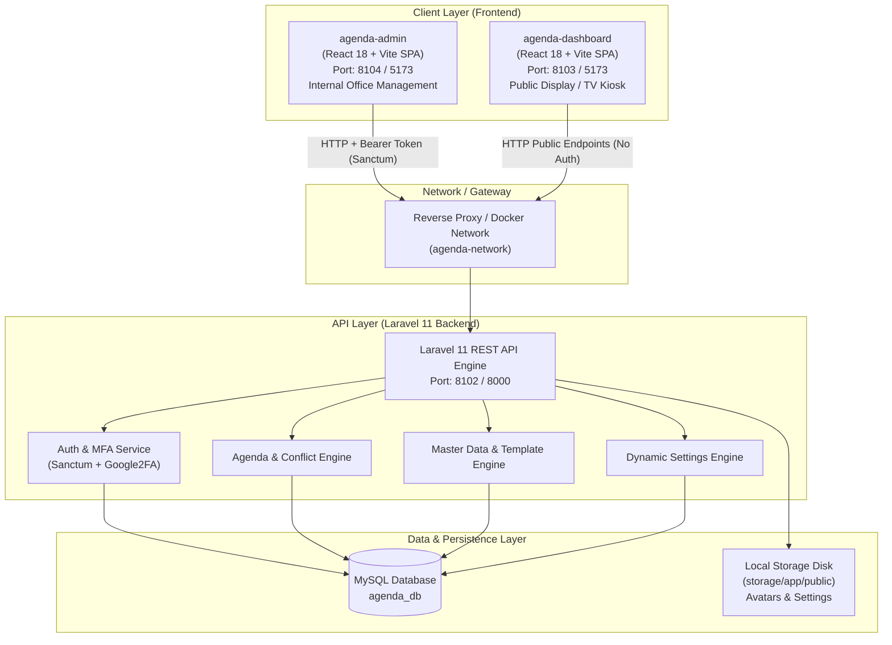
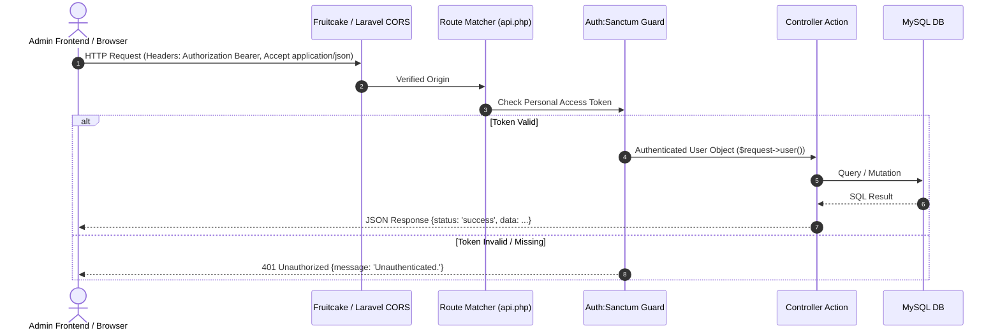

# Arsitektur Sistem & Pemetaan Komponen (System Architecture)

## 1. Diagram Arsitektur Tingkat Tinggi (High-Level Architecture)

Aplikasi **SIMANJA** mengusung arsitektur **Decoupled Client-Server (SPA + Headless REST API)** berbasis Monorepo. Seluruh interaksi data dilakukan melalui HTTP RESTful API dengan format payload standar JSON.



---

## 2. Struktur Repositori & Dekomposisi Aplikasi

```text
simanja-apps/
├── apps/
│   ├── agenda-backend/                 # Core Backend REST API (Laravel 11)
│   │   ├── app/
│   │   │   ├── Helpers/SettingHelper.php
│   │   │   ├── Http/Controllers/Api/   # 14 REST API Controllers
│   │   │   ├── Http/Requests/          # Form Request Validators
│   │   │   ├── Http/Resources/         # API Resource Transformers
│   │   │   ├── Models/                 # 25 Eloquent Models
│   │   │   ├── Services/               # Domain Business Logic (Auth, MasterData, Setting)
│   │   │   └── Traits/ApiResponse.php  # Standarisasi JSON Response
│   │   ├── database/
│   │   │   ├── migrations/             # Skema & DDL Migration Files
│   │   │   └── seeders/                # Master Seeder Data
│   │   └── routes/api.php              # Route Definition Terpusat
│   │
│   ├── agenda-admin/                   # React 18 Admin Dashboard (Vite)
│   │   └── src/
│   │       ├── api/                    # Axios Client & Interceptors
│   │       ├── components/             # Reusable UI & Layout Component
│   │       ├── contexts/               # AuthContext & SettingsContext
│   │       ├── layouts/                # AdminLayout, Sidebar, Topbar
│   │       ├── modules/                # Feature Modules:
│   │       │   ├── agenda/             # Manajemen Agenda per Unit
│   │       │   ├── audit/              # Audit Trail Viewer
│   │       │   ├── auth/               # Login & MFA Screens
│   │       │   ├── calendar/           # Visual Kalender Operasional
│   │       │   ├── dashboard/          # Admin Dashboard & Timeline
│   │       │   ├── master-data/        # Katalog Master & Template Surat
│   │       │   ├── notula/             # Notula Rapat & Peserta
│   │       │   ├── profile/            # Profil User & Aktivitas
│   │       │   ├── riwayat/            # Riwayat & Ekspor Agenda
│   │       │   ├── Roles/              # Role & Permission Matrix
│   │       │   ├── ruangan/            # Pemantauan & Jadwal Ruangan
│   │       │   ├── settings/           # Dynamic Settings Engine
│   │       │   └── Users/              # Manajemen User & Akun
│   │       └── AppRouter.jsx           # Client-Side Routing
│   │
│   └── agenda-dashboard/               # React 18 Public Screen / Kiosk (Vite)
│       └── src/
│           ├── components/             # LiveClock, RunningText, KPICards, Sidebar
│           ├── layouts/DashboardLayout # Fullscreen TV/Display Layout
│           ├── modules/Calendar/       # YearView & MainCalendar Grid
│           └── services/api.js         # Public API Service Fetchers
```

---

## 3. Pemetaan Lengkap Alur: Route → Controller → Service/Model → Database → View/Frontend

Berikut adalah pemetaan menyeluruh seluruh endpoint API aktual yang diimplementasikan pada backend beserta pasangannya di frontend:

| HTTP Method | API Route | Controller & Method | Model / Service Terkait | Tabel Database | Frontend Caller / View Component |
| :--- | :--- | :--- | :--- | :--- | :--- |
| **POST** | `/api/login` | `AuthController@login` | `AuthService`, `User`, `AuditLog` | `auth_users`, `trx_audit_logs`, `settings` | `agenda-admin/src/modules/auth/pages/LoginPage.jsx` via `AuthContext.login()` |
| **GET** | `/api/me` | `AuthController@me` | `User` | `auth_users`, `auth_roles`, `ref_pegawai` | `agenda-admin/src/contexts/AuthContext.jsx` (`checkAuth()`) |
| **POST** | `/api/logout` | `AuthController@logout` | `AuthService`, `AuditLog` | `personal_access_tokens`, `trx_audit_logs` | `agenda-admin/src/layouts/Sidebar.jsx` & `Topbar.jsx` |
| **POST** | `/api/change-password` | `AuthController@changePassword`| `AuthService`, `User` | `auth_users`, `trx_audit_logs` | `agenda-admin/src/modules/profile/pages/ProfilePage.jsx` |
| **GET** | `/api/mfa/setup` | `MfaController@setup` | `Google2FA`, `User`, `AuditLog` | `auth_users`, `trx_audit_logs` | `agenda-admin/src/pages/auth/MfaVerify.jsx` |
| **POST** | `/api/mfa/verify` | `MfaController@verify` | `Google2FA`, `User`, `AuditLog` | `auth_users`, `personal_access_tokens` | `agenda-admin/src/pages/auth/MfaVerify.jsx` via `AuthContext.verifyMfa()` |
| **POST** | `/api/mfa/disable` | `MfaController@disable` | `User`, `AuditLog` | `auth_users`, `trx_audit_logs` | `agenda-admin/src/modules/profile/pages/ProfilePage.jsx` |
| **GET** | `/api/settings/public` | `SettingController@publicSettings`| `Setting` | `settings` | `agenda-dashboard/src/services/api.js` (`fetchPublicSettings()`) & `SettingsContext` |
| **GET** | `/api/settings` | `SettingController@index` | `SettingService`, `SettingGroup`, `Setting` | `setting_groups`, `settings` | `agenda-admin/src/modules/settings/pages/SettingsPage.jsx` |
| **POST** | `/api/settings/bulk-update` | `SettingController@bulkUpdate` | `SettingService`, `Setting` | `settings` | `agenda-admin/src/modules/settings/pages/SettingsPage.jsx` (`handleSave`) |
| **GET** | `/api/public/dashboard/kpi` | `PublicDashboardController@kpi` | `Agenda` | `trx_agendas`, `ref_statuses` | `agenda-dashboard/src/services/api.js` (`fetchPublicKPI()`) |
| **GET** | `/api/public/dashboard/announcements` | `PublicDashboardController@announcements` | `Announcement` | `announcements` *(Fallback array jika tabel belum ada)* | `agenda-dashboard/src/services/api.js` (`fetchPublicAnnouncements()`) |
| **GET** | `/api/public/dashboard/events` | `PublicDashboardController@events` | `Agenda`, `Room`, `Employee` | `trx_agendas`, `trx_agenda_rooms`, `ref_rooms`, `ref_pegawai` | `agenda-dashboard/src/services/api.js` (`fetchPublicEvents()`) |
| **GET** | `/api/dashboard/kpi` | `DashboardController@kpi` | `Agenda` (`visibleTo`) | `trx_agendas`, `ref_statuses` | `agenda-admin/src/modules/dashboard/api/dashboardApi.js` (`getDashboardKpi`) |
| **GET** | `/api/dashboard/announcements` | `DashboardController@announcements` | `Announcement` | `announcements` *(Fallback array)* | `agenda-admin/src/modules/dashboard/api/dashboardApi.js` |
| **GET** | `/api/dashboard/events` | `DashboardController@events` | `Agenda` (`visibleTo`) | `trx_agendas`, `trx_agenda_rooms`, `trx_agenda_participants`, `ref_pegawai` | `agenda-admin/src/modules/dashboard/api/dashboardApi.js` (`getDashboardEvents`) |
| **GET** | `/api/units` | `UnitController@index` | `Unit` | `ref_units` | `agenda-admin/src/modules/agenda/services/agendaService.js` (`getUnits`) |
| **GET** | `/api/units/{unit}` | `UnitController@show` | `Unit` | `ref_units` | `agenda-admin/src/modules/agenda/services/agendaService.js` (`getUnitById`) |
| **GET** | `/api/units/{unit}/agendas` | `UnitController@agendas` | `Agenda` (`visibleTo`), `AgendaParticipant` | `trx_agendas`, `trx_agenda_participants`, `trx_agenda_rooms`, `ref_pegawai`, `ref_statuses` | `agenda-admin/src/modules/agenda/pages/AgendaManagePage.jsx` |
| **POST** | `/api/units/{unit}/agendas` | `UnitController@storeAgenda` | `Agenda`, `AgendaParticipant`, DB Transaction | `trx_agendas`, `trx_agenda_participants`, `trx_agenda_rooms` | `agenda-admin/src/modules/agenda/components/AgendaManagementWorkspace.jsx` |
| **GET** | `/api/agendas` | `AgendaController@index` | `Agenda` (`visibleTo`), DB raw filter | `trx_agendas`, `trx_notulas` | `agenda-admin/src/api/notulaApi.js` (`getAgendas()`) |
| **PUT/PATCH**| `/api/agendas/{uuid}/status` | `AgendaController@updateStatus` | `Agenda` | `trx_agendas`, `ref_statuses` | `agenda-admin/src/modules/agenda/components/AgendaManagementWorkspace.jsx` |
| **PUT** | `/api/agendas/{uuid}` | `AgendaController@update` | `Agenda`, `AgendaParticipant`, DB Transaction | `trx_agendas`, `trx_agenda_participants`, `trx_agenda_rooms` | `agenda-admin/src/modules/agenda/components/AgendaManagementWorkspace.jsx` |
| **DELETE** | `/api/agendas/{uuid}` | `AgendaController@destroy` | `Agenda`, `AgendaParticipant` | `trx_agendas`, `trx_agenda_participants` | `agenda-admin/src/modules/agenda/components/AgendaManagementWorkspace.jsx` |
| **GET** | `/api/history/agendas` | `AgendaController@history` | `Agenda` (`visibleTo`) | `trx_agendas`, `trx_agenda_rooms`, `ref_pegawai`, `ref_statuses` | `agenda-admin/src/modules/riwayat/services/historyService.js` (`getHistory`) |
| **GET** | `/api/history/agendas/export`| `AgendaController@exportHistory` | `Agenda` (`visibleTo`) | `trx_agendas`, `trx_agenda_rooms`, `ref_pegawai`, `ref_statuses` | `agenda-admin/src/modules/riwayat/services/historyService.js` (`exportHistory`) |
| **GET** | `/api/rooms` | `RoomController@index` | `Room`, `Agenda` (Dynamic Occupancy) | `ref_rooms`, `trx_agenda_rooms`, `trx_agendas` | `agenda-admin/src/modules/ruangan/pages/RoomsPage.jsx` |
| **GET** | `/api/rooms/{uid}` | `RoomController@show` | `Room`, `Agenda` (Detail & timeline) | `ref_rooms`, `trx_agenda_rooms`, `trx_agendas` | `agenda-admin/src/modules/ruangan/pages/RoomDetailPage.jsx` |
| **GET** | `/api/notulas` | `NotulaController@index` | `Notula`, `Agenda` | `trx_notulas`, `trx_agendas`, `trx_agenda_participants`, `ref_pegawai` | `agenda-admin/src/modules/notula/pages/MinutesPage.jsx` |
| **POST** | `/api/notulas` | `NotulaController@store` | `Notula` | `trx_notulas` | `agenda-admin/src/modules/notula/pages/MinutesPage.jsx` |
| **GET** | `/api/notulas/{notula}` | `NotulaController@show` | `Notula`, `Agenda` | `trx_notulas`, `trx_agendas`, `trx_agenda_participants`, `ref_pegawai` | `agenda-admin/src/modules/notula/pages/NotulaDetailPage.jsx` |
| **PUT** | `/api/notulas/{notula}` | `NotulaController@update` | `Notula` | `trx_notulas` | `agenda-admin/src/modules/notula/pages/NotulaDetailPage.jsx` |
| **DELETE** | `/api/notulas/{notula}` | `NotulaController@destroy` | `Notula` | `trx_notulas` | `agenda-admin/src/modules/notula/pages/MinutesPage.jsx` |
| **POST** | `/api/notulas/{uid}/participants` | `NotulaController@addParticipant` | `AgendaParticipant`, `Notula` | `trx_agenda_participants`, `trx_notulas` | `agenda-admin/src/modules/notula/pages/NotulaDetailPage.jsx` |
| **DELETE** | `/api/notulas/{uid}/participants/{id}` | `NotulaController@removeParticipant` | `AgendaParticipant`, `Notula` | `trx_agenda_participants`, `trx_notulas` | `agenda-admin/src/modules/notula/pages/NotulaDetailPage.jsx` |
| **GET** | `/api/users` | `UserController@index` | `User`, `Role`, `Employee` | `auth_users`, `auth_model_has_roles`, `ref_pegawai`, `ref_units` | `agenda-admin/src/modules/Users/pages/UsersPage.jsx` |
| **POST** | `/api/users` | `UserController@store` | `User`, `Employee`, Spatie Role | `auth_users`, `ref_pegawai`, `auth_model_has_roles` | `agenda-admin/src/modules/Users/pages/UsersPage.jsx` |
| **GET** | `/api/users/{user}` | `UserController@show` | `User` | `auth_users`, `ref_pegawai` | `agenda-admin/src/modules/Users/pages/UsersPage.jsx` |
| **PUT** | `/api/users/{user}` | `UserController@update` | `User`, `Employee`, Spatie Role | `auth_users`, `ref_pegawai`, `auth_model_has_roles` | `agenda-admin/src/modules/Users/pages/UsersPage.jsx` |
| **DELETE** | `/api/users/{user}` | `UserController@destroy` | `User`, `Employee` | `auth_users`, `ref_pegawai` | `agenda-admin/src/modules/Users/pages/UsersPage.jsx` |
| **PUT** | `/api/users/{user}/status`| `UserController@updateStatus` | `User` | `auth_users` | `agenda-admin/src/modules/Users/pages/UsersPage.jsx` |
| **POST** | `/api/users/{user}/reset-mfa` | `UserController@resetMfa` | `User` | `auth_users` | `agenda-admin/src/modules/Users/pages/UsersPage.jsx` |
| **POST** | `/api/users/bulk-delete` | `UserController@bulkDestroy` | `User`, `Employee` | `auth_users`, `ref_pegawai` | `agenda-admin/src/modules/Users/pages/UsersPage.jsx` |
| **GET** | `/api/users/export` | `UserController@export` | `User` | `auth_users`, `ref_pegawai` | `agenda-admin/src/modules/Users/pages/UsersPage.jsx` |
| **GET** | `/api/roles-permissions` | `RolePermissionController@index`| `Role`, `Permission` | `auth_roles`, `auth_permissions`, `auth_role_has_permissions` | `agenda-admin/src/modules/Roles/pages/RolesPermissionsPage.jsx` |
| **POST** | `/api/roles-permissions/toggle` | `RolePermissionController@toggle`| `Role`, `Permission` | `auth_role_has_permissions` | `agenda-admin/src/modules/Roles/pages/RolesPermissionsPage.jsx` |
| **GET** | `/api/master-data/{category}` | `MasterDataController@index` | `MasterDataService` | Dinamis (`ref_agenda_categories`, `ref_rooms`, `ref_units`, `ref_pegawai`, `ref_document_templates`, `ref_agenda_priorities`) | `agenda-admin/src/modules/master-data/pages/MasterDataManagePage.jsx` |
| **POST** | `/api/master-data/{category}` | `MasterDataController@store` | `MasterDataService` | Dinamis sesuai kategori | `agenda-admin/src/modules/master-data/pages/MasterDataManagePage.jsx` |
| **PUT** | `/api/master-data/{category}/{id}` | `MasterDataController@update` | `MasterDataService` | Dinamis sesuai kategori | `agenda-admin/src/modules/master-data/pages/MasterDataManagePage.jsx` |
| **DELETE** | `/api/master-data/{category}/{id}` | `MasterDataController@destroy` | `MasterDataService` | Dinamis sesuai kategori | `agenda-admin/src/modules/master-data/pages/MasterDataManagePage.jsx` |
| **GET** | `/api/master-data/template-surat/uuid/{uuid}` | `TemplateBuilderController@show` | `DocumentTemplate`, `DocumentTemplateBody` | `ref_document_templates`, `ref_document_templates_body` | `agenda-admin/src/modules/master-data/pages/TemplateDetailWorkspace.jsx` |
| **PUT** | `/api/master-data/template-surat/uuid/{uuid}` | `TemplateBuilderController@update` | `DocumentTemplate`, `DocumentTemplateBody` | `ref_document_templates`, `ref_document_templates_body` | `agenda-admin/src/modules/master-data/pages/TemplateDetailWorkspace.jsx` |
| **GET** | `/api/references/roles` | `ReferenceController@getRoles` | `Role` | `auth_roles` | Form Users & Modul Admin |
| **GET** | `/api/references/units` | `ReferenceController@getUnits` | `Unit` | `ref_units` | Dropdown Agenda & Unit Picker |
| **GET** | `/api/references/rooms` | `ReferenceController@getRooms` | `Room` | `ref_rooms` | Modal Form Agenda |
| **GET** | `/api/references/employees` | `ReferenceController@getEmployees` | `Employee` | `ref_pegawai` | PIC & Peserta Multi-select |
| **GET** | `/api/references/event-types` | `ReferenceController@getEventTypes`| `EventType` | `ref_event_types` | Modal Form Agenda (CAT/Kegiatan) |
| **GET** | `/api/references/officer-positions` | `ReferenceController@getOfficerPositions` | `OfficerPosition` | `ref_officer_positions` | Form Petugas Fasilitasi CAT |
| **GET** | `/api/references/employee-availability` | `ReferenceController@getEmployeeAvailability` | `Employee`, `Agenda`, `AgendaParticipant` | `ref_pegawai`, `trx_agendas`, `trx_agenda_participants` | Realtime Conflict Indicator di Form Agenda |
| **GET** | `/api/references/room-availability` | `ReferenceController@getRoomAvailability` | `Room` | `ref_rooms` | Realtime Room Picker |
| **GET** | `/api/references/agenda-categories` | `ReferenceController@getAgendaCategories` | `AgendaCategory` | `ref_agenda_categories` | Dropdown Kategori Agenda |
| **GET** | `/api/profile` | `ProfileController@show` | `User` | `auth_users`, `ref_pegawai`, `ref_units` | `agenda-admin/src/modules/profile/pages/ProfilePage.jsx` |
| **PUT** | `/api/profile` | `ProfileController@update` | `User`, `Employee`, `AuditLog` | `auth_users`, `ref_pegawai`, `trx_audit_logs` | `agenda-admin/src/modules/profile/pages/ProfilePage.jsx` |
| **POST** | `/api/profile/avatar` | `ProfileController@uploadAvatar` | `User`, `Storage`, `AuditLog` | `auth_users`, `trx_audit_logs`, Disk Storage | `agenda-admin/src/modules/profile/pages/ProfilePage.jsx` |
| **DELETE** | `/api/profile/avatar` | `ProfileController@removeAvatar` | `User`, `Storage`, `AuditLog` | `auth_users`, `trx_audit_logs` | `agenda-admin/src/modules/profile/pages/ProfilePage.jsx` |
| **GET** | `/api/profile/activity` | `ProfileController@activity` | `AuditLog` | `trx_audit_logs` | `agenda-admin/src/modules/profile/pages/ProfilePage.jsx` |

---

## 4. Pipeline Middleware & Keamanan API



### Mekanisme Khusus Token & MFA:
1. **Full Access Token (`auth_token`)**: Memiliki abilities `['*']`, diterbitkan setelah login biasa berhasil (jika user tidak wajib MFA) ATAU setelah verifikasi TOTP 6-digit sukses di `MfaController@verify`.
2. **Temporary MFA Token (`mfa_temp_token`)**: Memiliki abilities `['mfa_verify']`, hanya dapat mengakses endpoint `POST /api/mfa/verify` dan `GET /api/mfa/setup`. Tidak dapat mengakses resource operasional.
