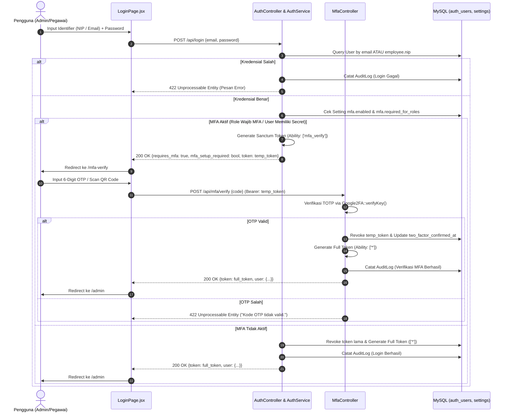
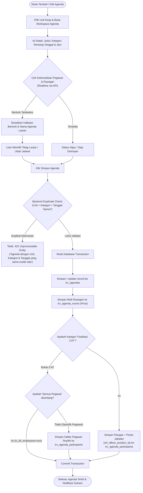
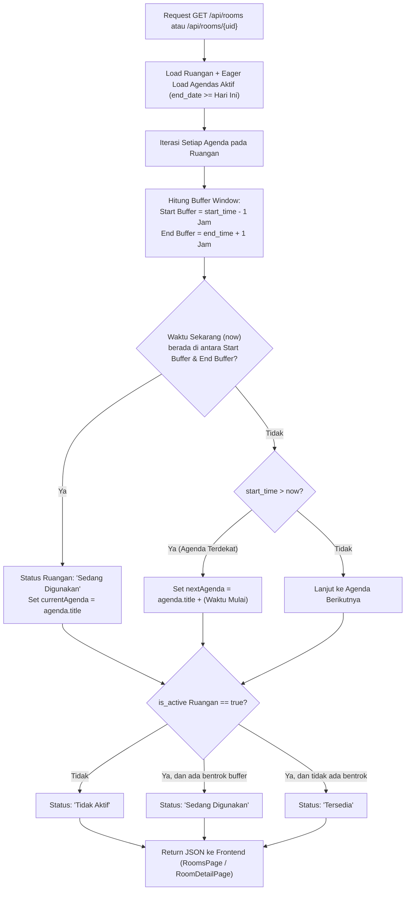
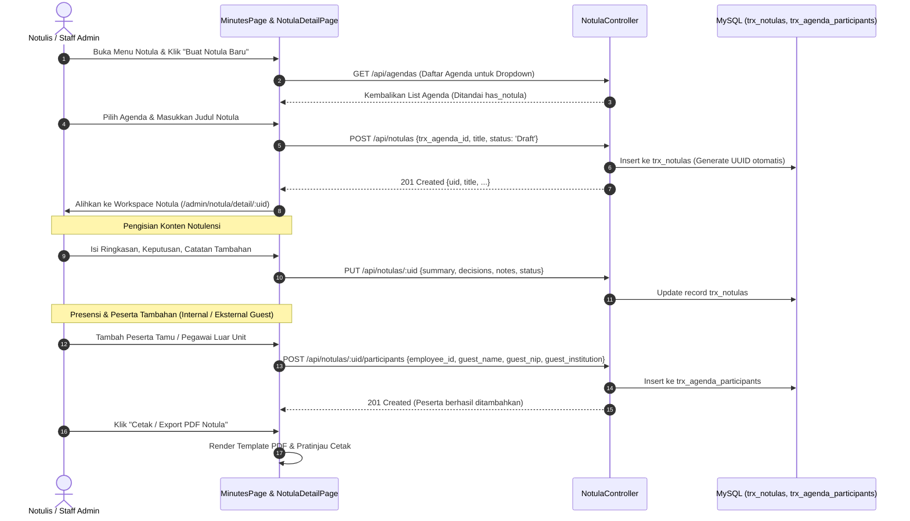
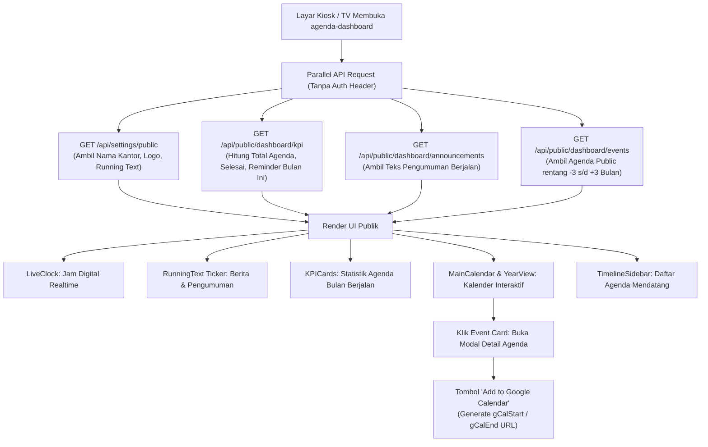

# Alur Bisnis Sistem (Business Flow)

Dokumen ini memetakan seluruh alur proses bisnis (*business flow*) dari setiap modul yang berjalan di SIMANJA berdasarkan implementasi aktual pada source code.

---

## 1. Alur Autentikasi & Multi-Factor Authentication (MFA / 2FA)

Sistem mengizinkan pengguna masuk menggunakan **NIP Pegawai** atau **Alamat Email**. Implementasi MFA didukung menggunakan protokol TOTP (Google Authenticator) via library `PragmaRX\Google2FA`.

---

## 2. Alur Manajemen Agenda & Pendeteksian Konflik Jadwal

Pengelolaan agenda dilakukan per **Unit Kerja** (`ref_units`). Sistem dilengkapi mesin pendeteksi bentrok jadwal pegawai (`ReferenceController@getEmployeeAvailability`) dan pencegahan duplikasi data agenda.

### Lifecycle Status Agenda:
1. **Draft**: Agenda baru dicatat, belum final.
2. **Terjadwal / Publish**: Agenda resmi diagendakan, dapat dilihat di kalender admin dan layar display publik jika `publish_type = 'public'`.
3. **Butuh Approval**: Agenda menunggu persetujuan (fitur struktur data telah ada di `AgendaApproval`).
4. **Selesai**: Agenda telah terlaksana.
5. **Batal**: Agenda dibatalkan (tidak dimunculkan pada kalender publik).

---

## 3. Alur Pemantauan Okupansi Ruangan (Dynamic Room Occupancy)

Status penggunaan ruangan (`ref_rooms`) tidak disimpan sebagai status statis di database, melainkan **dihitung secara dinamis saat runtime** oleh `RoomController` berdasarkan jadwal agenda yang aktif:

---

## 4. Alur Pembuatan & Pengelolaan Notula Rapat (Meeting Minutes)

Modul Notula (`trx_notulas`) berfungsi mencatat hasil pelaksanaan agenda rapat, notulensi keputusan, catatan tindak lanjut, dan daftar presensi kehadiran peserta.

---

## 5. Alur Layar Display Publik & Kiosk (`agenda-dashboard`)

Aplikasi `agenda-dashboard` dirancang untuk berjalan tanpa autentikasi (*public display screen*) pada TV informasi lobi atau kiosk digital kantor.

---

## 6. Alur Template Builder Dokumen & Surat Tugas

Sistem menyediakan builder visual untuk template surat kedinasan (`ref_document_templates` & `ref_document_templates_body`):

1. Admin membuka **Master Data → Template Surat**.
2. Memilih template atau membuat template baru dengan menentukan:
   * **Kategori Dokumen** (e.g. Surat Tugas, Undangan, Berita Acara).
   * **Format Nomor Surat** (e.g. `ST/{UNIT}/{ROMAN_MONTH}/{YEAR}`).
3. Masuk ke **Template Builder Workspace** (`TemplateDetailWorkspace.jsx`):
   * Mengatur **Kop Surat**.
   * Menulis klausul **Menimbang**, **Mengingat**, dan **Memperhatikan**.
   * Menyusun **Body Content** dokumen menggunakan editor teks.
4. Backend menyimpan data header di `ref_document_templates` dan rincian klausul di `ref_document_templates_body` menggunakan relasi `hasOne`.

---

## 7. Alur Dynamic System Settings Engine

Pengaturan aplikasi dikelola secara terpusat dan dinamis:
1. `setting_groups` mengelompokkan setelan (misal: General, Security/MFA, Notifications).
2. Setiap `settings` memiliki tipe data (`text`, `boolean`, `select`, `multiselect`, `image`, `password`).
3. Endpoint `POST /api/settings/bulk-update` menerima key-value secara kolektif:
   * Tipe `image` disimpan ke storage publik.
   * Tipe `password` (misal SMTP) dienkripsi menggunakan `Crypt::encryptString`.
   * Cache `app_settings` dibersihkan otomatis via `Cache::forget('app_settings')`.
   * Setelan dengan `is_public = true` diekspos melalui `GET /api/settings/public`.
