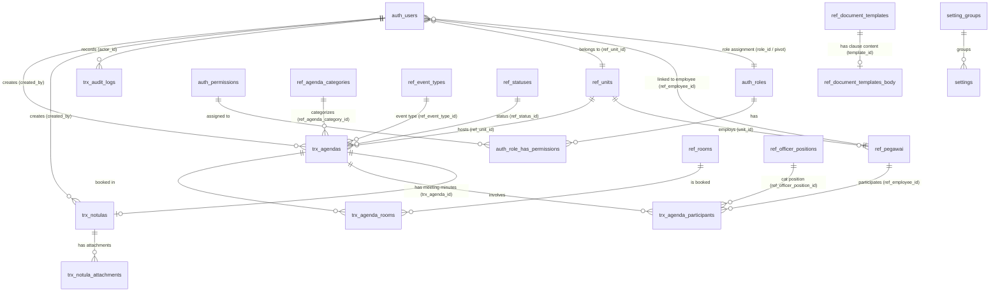

# Struktur & Relasi Database (Database Schema & Dictionary)

Dokumen ini mendokumentasikan skema database fisik, kamus data per tabel (*data dictionary*), relasi antar tabel (ERD), foreign keys, dan indeks pada database `agenda_db`.

---

## 1. Entity-Relationship Diagram (ERD)

---

## 2. Kamus Data Tabel (Data Dictionary)

### A. Modul Autentikasi, Pengguna & RBAC

#### 1. Tabel `auth_users`
Menyimpan akun pengguna sistem.
| Kolom | Tipe Data | Nullable | Default | Keterangan & Relasi |
| :--- | :--- | :--- | :--- | :--- |
| `id` | BIGINT UNSIGNED | No | Auto Inc | Primary Key |
| `role_id` | BIGINT UNSIGNED | Yes | NULL | FK ke `auth_roles.id` |
| `ref_employee_id` | BIGINT UNSIGNED | Yes | NULL | FK ke `ref_pegawai.id` / `ref_employees.id` |
| `ref_unit_id` | BIGINT UNSIGNED | Yes | NULL | FK ke `ref_units.id` |
| `name` | VARCHAR(255) | No | - | Nama lengkap / tampilan user |
| `email` | VARCHAR(255) | No | - | Unique email user |
| `email_verified_at`| TIMESTAMP | Yes | NULL | Waktu verifikasi email |
| `password` | VARCHAR(255) | No | - | Bcrypt / Hashed password |
| `phone` | VARCHAR(50) | Yes | NULL | Nomor kontak |
| `address` | TEXT | Yes | NULL | Alamat domisili |
| `avatar` | VARCHAR(255) | Yes | NULL | Path file avatar di storage disk |
| `two_factor_secret`| TEXT | Yes | NULL | Secret TOTP (Google2FA) |
| `two_factor_recovery_codes` | TEXT | Yes | NULL | Recovery codes MFA |
| `two_factor_confirmed_at` | TIMESTAMP | Yes | NULL | Waktu konfirmasi aktivasi MFA |
| `is_active` | TINYINT(1) | No | 1 | Status aktif akun (1=Aktif, 0=Nonaktif) |
| `remember_token` | VARCHAR(100) | Yes | NULL | Token remember login |
| `created_at` / `updated_at` | TIMESTAMP | Yes | NULL | Timestamps |

#### 2. Tabel `auth_roles`
Tabel role otorisasi pengguna (Spatie / Custom RBAC).
| Kolom | Tipe Data | Nullable | Default | Keterangan |
| :--- | :--- | :--- | :--- | :--- |
| `id` | BIGINT UNSIGNED | No | Auto Inc | Primary Key |
| `name` | VARCHAR(255) | No | - | Nama Role (Super Admin, Admin, User) |
| `guard_name` | VARCHAR(255) | No | `web` / `api` | Guard identifier |
| `slug` | VARCHAR(100) | Yes | NULL | Unique slug role |
| `description` | TEXT | Yes | NULL | Deskripsi tugas role |
| `is_system` | TINYINT(1) | No | 0 | Penanda role sistem inti |
| `is_active` | TINYINT(1) | No | 1 | Status aktif role |
| `created_at` / `updated_at` | TIMESTAMP | Yes | NULL | Timestamps |

#### 3. Tabel `auth_permissions`
Tabel master izin hak akses sistem.
| Kolom | Tipe Data | Nullable | Default | Keterangan |
| :--- | :--- | :--- | :--- | :--- |
| `id` | BIGINT UNSIGNED | No | Auto Inc | Primary Key |
| `name` | VARCHAR(255) | No | - | Nama permission (e.g. `view_agenda`, `view_users`) |
| `guard_name` | VARCHAR(255) | No | `web` / `api` | Guard identifier |
| `group_name` / `module` | VARCHAR(100) | Yes | NULL | Pengelompokan modul |
| `slug` | VARCHAR(100) | Yes | NULL | Slug kode permission |
| `description` | TEXT | Yes | NULL | Deskripsi izin |
| `created_at` / `updated_at` | TIMESTAMP | Yes | NULL | Timestamps |

#### 4. Tabel `auth_role_has_permissions`
Pivot relasi Role ke Permission (*Many-to-Many*).
| Kolom | Tipe Data | Nullable | Default | Keterangan |
| :--- | :--- | :--- | :--- | :--- |
| `permission_id` | BIGINT UNSIGNED | No | - | FK ke `auth_permissions.id` (Cascade Delete) |
| `role_id` | BIGINT UNSIGNED | No | - | FK ke `auth_roles.id` (Cascade Delete) |
| **Primary Key** | `(permission_id, role_id)` | | | Composite Key |

#### 5. Tabel `personal_access_tokens`
Penyimpanan Bearer Token untuk Laravel Sanctum.
| Kolom | Tipe Data | Nullable | Default | Keterangan |
| :--- | :--- | :--- | :--- | :--- |
| `id` | BIGINT UNSIGNED | No | Auto Inc | Primary Key |
| `tokenable_type`| VARCHAR(255) | No | - | Morph type (`App\Models\User`) |
| `tokenable_id` | BIGINT UNSIGNED | No | - | Morph ID (User ID) |
| `name` | VARCHAR(255) | No | - | Token name (`auth_token` / `mfa_temp_token`) |
| `token` | VARCHAR(64) | No | - | SHA-256 Hashed Token (Unique) |
| `abilities` | TEXT | Yes | NULL | Token abilities JSON (`['*']` atau `['mfa_verify']`) |
| `last_used_at` | TIMESTAMP | Yes | NULL | Waktu pemakaian terakhir |
| `expires_at` | TIMESTAMP | Yes | NULL | Waktu kedaluwarsa |

---

### B. Modul Master Data & Referensi

#### 1. Tabel `ref_units`
Unit kerja struktural / tim kerja di lingkungan Kanreg.
| Kolom | Tipe Data | Nullable | Default | Keterangan |
| :--- | :--- | :--- | :--- | :--- |
| `id` | BIGINT UNSIGNED | No | Auto Inc | Primary Key |
| `uid` | CHAR(36) | Yes | NULL | UUID Unit |
| `code` | VARCHAR(50) | No | - | Unique kode unit (e.g. `SID`, `TU-KR`) |
| `name` | VARCHAR(150) | No | - | Nama lengkap unit kerja |
| `description` | TEXT | Yes | NULL | Deskripsi tugas unit |
| `deleted_at` | TIMESTAMP | Yes | NULL | Soft Delete |

#### 2. Tabel `ref_rooms`
Master ruangan rapat dan ruang kegiatan.
| Kolom | Tipe Data | Nullable | Default | Keterangan |
| :--- | :--- | :--- | :--- | :--- |
| `id` | BIGINT UNSIGNED | No | Auto Inc | Primary Key |
| `uid` | CHAR(36) | Yes | NULL | UUID Ruangan |
| `code` | VARCHAR(50) | No | - | Unique kode ruangan |
| `name` | VARCHAR(150) | No | - | Nama ruangan (e.g. Ruang Rapat Utama) |
| `capacity` | INT | No | 0 | Kapasitas kursi |
| `location` | VARCHAR(255) | Yes | NULL | Lokasi lantai / gedung |
| `facilities` | JSON | Yes | NULL | Daftar fasilitas (Array JSON) |
| `is_active` | TINYINT(1) | No | 1 | Status ketersediaan master ruangan |
| `deleted_at` | TIMESTAMP | Yes | NULL | Soft Delete |

#### 3. Tabel `ref_pegawai` *(Database Nyata Aktual)*
Master data seluruh pegawai internal Kanreg.
| Kolom | Tipe Data | Nullable | Default | Keterangan |
| :--- | :--- | :--- | :--- | :--- |
| `id` | BIGINT UNSIGNED | No | Auto Inc | Primary Key |
| `nip` | VARCHAR(50) | Yes | NULL | Nomor Induk Pegawai 18-digit (Unique) |
| `nama` | VARCHAR(150) | No | - | Nama lengkap dan gelar pegawai |
| `gender` | VARCHAR(10) | Yes | `1` | Jenis kelamin |
| `status_pegawai` | VARCHAR(50) | Yes | NULL | Status kepegawaian (PNS, PPPK, Honorer) |
| `unit_id` | BIGINT UNSIGNED | Yes | NULL | FK ke `ref_units.id` |
| `is_status` | TINYINT(1) | No | 1 | Status keaktifan pegawai (1=Aktif, 0=Nonaktif) |

#### 4. Tabel `ref_agenda_categories`
Kategori agenda (Rapat, Monitoring, Sosialisasi, Fasilitasi CAT, dsb).
| Kolom | Tipe Data | Nullable | Default | Keterangan |
| :--- | :--- | :--- | :--- | :--- |
| `id` | BIGINT UNSIGNED | No | Auto Inc | Primary Key |
| `name` | VARCHAR(100) | No | - | Nama kategori |
| `description` | TEXT | Yes | NULL | Penjelasan |
| `is_active` | TINYINT(1) | No | 1 | Status aktif |

#### 5. Tabel `ref_event_types` & `ref_officer_positions`
Master tipe kegiatan khusus dan posisi petugas Fasilitasi CAT.
* `ref_event_types`: `id`, `code`, `name`, `description`, `is_active`.
* `ref_officer_positions`: `id`, `code`, `name`, `description`, `is_active` (e.g. Koordinator Lapangan, Admin Server, Pengawas Ruang).

#### 6. Tabel `ref_document_templates` & `ref_document_templates_body`
Master template surat tugas dan dokumen dinas.
* `ref_document_templates`: `id`, `uid`, `code`, `name`, `category`, `format_nomor`, `is_active`.
* `ref_document_templates_body`: `id`, `template_id` (FK), `kop_surat`, `menimbang` (LONGTEXT), `mengingat` (LONGTEXT), `memperhatikan` (LONGTEXT), `body_content` (LONGTEXT).

---

### C. Modul Transaksional (Agenda, Notula & Audit)

#### 1. Tabel `trx_agendas`
Pusat pencatatan seluruh agenda kegiatan di SIMANJA.
| Kolom | Tipe Data | Nullable | Default | Keterangan & Relasi |
| :--- | :--- | :--- | :--- | :--- |
| `id` | BIGINT UNSIGNED | No | Auto Inc | Primary Key |
| `st_number` | VARCHAR(100) | Yes | NULL | Nomor Surat Tugas |
| `nd_number` | VARCHAR(100) | Yes | NULL | Nomor Nota Dinas |
| `title` | VARCHAR(255) | No | - | Judul / Nama Kegiatan |
| `description` | TEXT | Yes | NULL | Rincian / Deskripsi Kegiatan |
| `ref_unit_id` | BIGINT UNSIGNED | Yes | NULL | FK ke `ref_units.id` (Penyelenggara) |
| `ref_agenda_category_id` | BIGINT UNSIGNED | Yes | NULL | FK ke `ref_agenda_categories.id` |
| `ref_event_type_id` | BIGINT UNSIGNED | Yes | NULL | FK ke `ref_event_types.id` |
| `ref_status_id` | BIGINT UNSIGNED | Yes | NULL | FK ke `ref_statuses.id` |
| `ref_room_id` | BIGINT UNSIGNED | Yes | NULL | *Legacy Single Room FK* (Kini pakai pivot) |
| `pic_employee_id` | BIGINT UNSIGNED | Yes | NULL | FK ke `ref_pegawai.id` (Penanggung Jawab) |
| `start_date` | DATE | No | - | Tanggal mulai kegiatan |
| `end_date` | DATE | No | - | Tanggal selesai kegiatan |
| `start_time` | TIME | No | - | Jam mulai |
| `end_time` | TIME | No | - | Jam selesai |
| `is_online` | TINYINT(1) | No | 0 | Penanda online (1=Online, 0=Offline) |
| `offline_location` | VARCHAR(255) | Yes | NULL | Lokasi manual luar kantor jika non-ruangan |
| `online_url` | VARCHAR(255) | Yes | NULL | Link Zoom / Google Meet |
| `online_meeting_id`| VARCHAR(100) | Yes | NULL | ID Rapat Online |
| `online_password` | VARCHAR(100) | Yes | NULL | Password Rapat Online |
| `is_all_employees` | TINYINT(1) | No | 1 | Target: 1=Semua Pegawai, 0=Peserta Khusus |
| `publish_type` | VARCHAR(20) | No | `public` | Visibilitas: `public`, `unit`, `personal` |
| `created_by` | BIGINT UNSIGNED | Yes | NULL | FK ke `auth_users.id` (Pembuat Agenda) |
| `deleted_at` | TIMESTAMP | Yes | NULL | Soft Delete |

#### 2. Tabel `trx_agenda_rooms` (Pivot Multi-Ruangan)
| Kolom | Tipe Data | Nullable | Default | Keterangan |
| :--- | :--- | :--- | :--- | :--- |
| `id` | BIGINT UNSIGNED | No | Auto Inc | Primary Key |
| `trx_agenda_id` | BIGINT UNSIGNED | No | - | FK ke `trx_agendas.id` (Cascade Delete) |
| `ref_room_id` | BIGINT UNSIGNED | No | - | FK ke `ref_rooms.id` (Cascade Delete) |

#### 3. Tabel `trx_agenda_participants` (Peserta & Petugas CAT)
| Kolom | Tipe Data | Nullable | Default | Keterangan |
| :--- | :--- | :--- | :--- | :--- |
| `id` | BIGINT UNSIGNED | No | Auto Inc | Primary Key |
| `trx_agenda_id` | BIGINT UNSIGNED | No | - | FK ke `trx_agendas.id` (Cascade Delete) |
| `ref_employee_id` | BIGINT UNSIGNED | Yes | NULL | FK ke `ref_pegawai.id` (Jika pegawai internal) |
| `ref_officer_position_id`| BIGINT UNSIGNED | Yes | NULL | FK ke `ref_officer_positions.id` (Jika CAT) |
| `guest_name` | VARCHAR(150) | Yes | NULL | Nama tamu luar / eksternal |
| `guest_nip` | VARCHAR(50) | Yes | NULL | NIP tamu luar jika ada |
| `guest_institution` | VARCHAR(150) | Yes | NULL | Asal instansi tamu luar |

#### 4. Tabel `trx_notulas` & `trx_notula_attachments`
* `trx_notulas`: `id`, `uuid` / `uid`, `trx_agenda_id` (FK), `title`, `status` (Draft/Final), `summary` (LONGTEXT), `decisions` (LONGTEXT), `notes` (LONGTEXT), `created_by` (FK), `deleted_at`.
* `trx_notula_attachments`: `id`, `trx_notula_id` (FK), `file_name`, `file_path`, `file_type`, `file_size`.

#### 5. Tabel `trx_audit_logs`
Mencatat seluruh rekam jejak aktivitas operasional.
* Kolom: `id`, `actor_id` (FK `auth_users.id`), `module`, `action`, `auditable_type`, `auditable_id`, `before_values` (JSON), `after_values` (JSON), `metadata` (JSON), `ip_address`, `user_agent`, `created_at`.

---

### D. Modul Pengaturan Sistem (Settings Engine)

#### 1. Tabel `setting_groups`
* `id`, `code` (Unique, e.g. `general`, `mfa`, `notifications`), `name`, `description`, `order_no`.

#### 2. Tabel `settings`
* `id`, `group_id` (FK), `key` (Unique, e.g. `app.name`, `mfa.enabled`), `label`, `value`, `default_value`, `type` (`text`, `boolean`, `select`, `multiselect`, `image`, `password`), `options` (JSON), `description`, `is_public` (TINYINT 1), `is_system` (TINYINT 1), `validation`, `order_no`.
