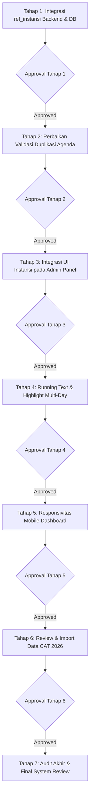

# Rencana & Urutan Implementasi Bertahap (Implementation Roadmap)

Dokumen ini menjadi **panduan eksekusi resmi** untuk setiap tahapan penyempurnaan modul Agenda pada project SIMANJA. Sesuai dengan instruksi operasional, pengembangan dilakukan **tahap demi tahap secara terisolasi**, di mana setiap tahap wajib melalui pengujian, review, dan approval sebelum melangkah ke tahap berikutnya.

---

## Matriks Tahapan Pengembangan (Phased Implementation Matrix)

---

## Rincian Tahapan & Checklist Eksekusi

---

### TAHAP 1 — Integrasi `ref_instansi` pada Backend & Database
* **Fokus Dokumen**: [`01-instansi-agenda.md`](./01-instansi-agenda.md)
* **Tujuan**: Mempersiapkan skema basis data, model Eloquent, dan endpoint API backend agar transaksi agenda mendukung relasi instansi penyelenggara/mitra.
* **Langkah Kerja**:
  1. Buat dan jalankan file migration: `add_ref_instansi_id_to_trx_agendas_table.php`.
  2. Buat Model `app/Models/Instansi.php` untuk tabel `ref_instansi`.
  3. Perbarui Model `app/Models/Agenda.php` (tambahkan relasi `instansi()` dan `$fillable`).
  4. Tambahkan method `getInstansi()` pada `ReferenceController.php` dan daftarkan route `GET /api/references/instansi`.
  5. Perbarui `UnitController.php` (`agendas`, `storeAgenda`) dan `AgendaController.php` (`update`, `history`, `exportHistory`) untuk validasi & penyimpanan `ref_instansi_id`.
* **Kriteria Pengujian (Testing)**:
  * Migration berhasil tanpa error.
  * Endpoint `GET /api/references/instansi` mengembalikan daftar instansi aktif.
  * Endpoint `POST /units/{unit}/agendas` dan `PUT /agendas/{uuid}` berhasil menyimpan `ref_instansi_id`.
* **Output Tahap**: Backend siap menyajikan dan menerima data instansi.
* **Status**: ✅ **SELESAI (Completed & Verified)**.

---

### TAHAP 2 — Perbaikan Validasi Duplikasi Agenda
* **Fokus Dokumen**: [`02-validasi-agenda.md`](./02-validasi-agenda.md)
* **Tujuan**: Memperbaiki logika deteksi bentrok agar agenda dengan Unit Kerja, Kategori, dan Periode yang sama **tetap diizinkan jika lokasi kegiatannya berbeda**.
* **Langkah Kerja**:
  1. Implementasikan fungsi validasi duplikasi terpadu `checkDuplicateAgenda(...)` pada controller / validation service.
  2. Perbarui `UnitController@storeAgenda` dengan logika validasi baru.
  3. Perbarui `AgendaController@update` dengan logika validasi baru.
* **Kriteria Pengujian (Testing)**:
  * Agenda unit sama + kategori sama + tanggal sama + **ruangan sama** $\rightarrow$ DITOLAK (422 Duplicate).
  * Agenda unit sama + kategori sama + tanggal sama + **ruangan beda** $\rightarrow$ DIIZINKAN (200/201).
  * Agenda unit sama + kategori sama + tanggal sama + **lokasi luar beda** $\rightarrow$ DIIZINKAN (200/201).
  * Edit agenda yang sama tidak mendeteksi bentrok dengan dirinya sendiri.
* **Output Tahap**: Validasi akurat, mencegah penolakan keliru pada kegiatan multi-lokasi.
* **Status**: ✅ **SELESAI (Completed & Verified - 7 Test Scenarios Passed)**.

---

### TAHAP 3 — Integrasi UI Instansi pada Admin Panel (`apps/agenda-admin`)
* **Fokus Dokumen**: [`01-instansi-agenda.md`](./01-instansi-agenda.md)
* **Tujuan**: Menambahkan input Searchable Select Instansi pada Modal Tambah/Edit dan menampilkan informasi Instansi pada Modal Detail di halaman kelola agenda.
* **Langkah Kerja**:
  1. Tambahkan `getInstansi()` pada `apps/agenda-admin/src/modules/agenda/services/agendaService.js`.
  2. Perbarui `AgendaManagementWorkspace.jsx`:
     * Fetch master instansi pada saat mount.
     * Integrasikan komponen `Select` (searchable select) pada form Tambah dan Edit Agenda.
     * Tampilkan baris "Instansi" pada Modal Detail Agenda (`selectedActivity`).
     * Sertakan `instansiId` pada payload pembuatan & pembaharuan agenda.
* **Kriteria Pengujian (Testing)**:
  * Dropdown instansi dapat dicari dengan mengetikkan nama instansi / kode.
  * Form tambah dan edit dapat menyimpan instansi terpilih.
  * Modal detail menampilkan nama instansi dengan benar.
* **Output Tahap**: Admin dapat mengelola agenda dengan atribut instansi secara visual.
* **Status**: ✅ **SELESAI (Completed & Verified)**.

---

### TAHAP 4 — Penyesuaian Running Text & Highlight "Sedang Berlangsung" Multi-Day
* **Fokus Dokumen**: [`05-running-text.md`](./05-running-text.md) & [`06-highlight-agenda.md`](./06-highlight-agenda.md)
* **Tujuan**: Memastikan agenda multi-day (misal: 24 s.d. 26 Sept) tetap tampil di Running Text dan Highlight Card pada seluruh hari dalam periode tersebut.
* **Langkah Kerja**:
  1. Perbarui evaluasi `runningTextMessages` pada `apps/agenda-dashboard/src/layouts/DashboardLayout.jsx` menggunakan rentang tanggal inklusif `[start, end]`.
  2. Perbarui helper evaluasi `currentEvent` dan `isPast` pada `apps/agenda-dashboard/src/components/TimelineSidebar.jsx`.
  3. Selaraskan `DashboardPage.jsx` dan `DashboardTimelineSidebar.jsx` pada `agenda-admin`.
* **Kriteria Pengujian (Testing)**:
  * Agenda multi-day tampil di running text pada hari ke-1, hari ke-2, dan hari ke-3.
  * Kartu "Sedang Berlangsung" aktif pada jam kerja di seluruh hari periode kegiatan.
* **Output Tahap**: Informasi publik dan highlight real-time akurat untuk semua durasi agenda.
* **Status**: ✅ **SELESAI (Completed & Verified)**.

---

### TAHAP 5 — Optimasi Responsivitas Dashboard Mobile
* **Fokus Dokumen**: [`04-dashboard-mobile.md`](./04-dashboard-mobile.md)
* **Tujuan**: Membuat halaman display publik mengalir lancar dalam 1 vertical scroll pada mobile tanpa mengunci highlight card atau merusak layout desktop.
* **Langkah Kerja**:
  1. Refactor class wrapper `DashboardLayout.jsx` menjadi `min-h-screen xl:h-screen xl:overflow-hidden`.
  2. Hapus batasan kaku `max-h-[60vh]` pada `TimelineSidebar.jsx` di breakpoint mobile, pertahankan `xl:overflow-y-auto` untuk desktop.
  3. Pastikan `sticky` hanya aktif pada breakpoint desktop.
* **Kriteria Pengujian (Testing)**:
  * Tampilan mobile (375px - 768px): Satu alur scroll halaman menyeluruh, kartu highlight bergerak dinamis saat di-scroll.
  * Tampilan desktop ($\ge 1280\text{px}$): Layout 2-kolom side-by-side tetap utuh tanpa pergeseran.
* **Output Tahap**: Antarmuka responsif sempurna di semua ukuran perangkat.
* **Status**: ✅ **SELESAI (Completed & Verified)**.

---

### TAHAP 6 — Review & Eksekusi Import Data CAT 2026
* **Fokus Dokumen**: [`03-import-jadwal-cat.md`](./03-import-jadwal-cat.md)
* **Tujuan**: Mengimpor 179 baris jadwal Fasilitasi CAT 2026 dari Excel ke database setelah mapping disetujui.
* **Langkah Kerja**:
  1. Klarifikasi dan konfirmasi keputusan terkait 31 alias instansi dan penanganan tanggal terputus.
  2. Buat script seeder / artisan command `ImportJadwalCATSeeder.php`.
  3. Jalankan **Dry Run (Simulasi)** dan verifikasi log hasil mapping.
  4. Minta approval final User sebelum commit database.
  5. Eksekusi import riil dan verifikasi integritas data di database.
* **Kriteria Pengujian (Testing)**:
  * Seluruh 179 agenda CAT terimpor dengan status `Publish`, kategori `Fasilitasi CAT`, dan relasi instansi yang tepat.
  * Tidak ada error foreign key atau data korup.
* **Output Tahap**: Seluruh jadwal CAT 2026 terintegrasi penuh ke dalam sistem SIMANJA.
* **Status**: ✅ **SELESAI (Completed & Injected - 170 Agenda Records Clean)**.

---

### TAHAP 7 — Audit Akhir & Final System Review
* **Fokus Dokumen**: Seluruh dokumen `/brief/*` dan `/brief/planning/*`
* **Tujuan**: Melakukan verifikasi regresi menyeluruh (*end-to-end regression testing*) terhadap seluruh ekosistem SIMANJA.
* **Langkah Kerja**:
  1. Uji menyeluruh seluruh flow: Buat Agenda $\rightarrow$ Tampil di Admin Calendar $\rightarrow$ Tampil di Public Dashboard $\rightarrow$ Buat Notula.
  2. Pastikan permission dan otorisasi role tetap terlindungi.
  3. Update dokumentasi teknis di `/brief/*`.
  4. Sajikan laporan akhir perubahan ke User.
* **Status**: ✅ **SELESAI (Completed & Verified - All Backend & Frontend Builds Passed)**.

---

## Aturan Komunikasi & Gate Approval

Setiap kali satu tahap selesai:
1. Agent melaporkan hasil perubahan kode, database, dan pengujian tahap tersebut.
2. Agent **STOP** dan menunggu pesan persetujuan (*Approval*) dari User.
3. Dilarang melanjutkan ke tahap berikutnya tanpa konfirmasi eksplisit.
