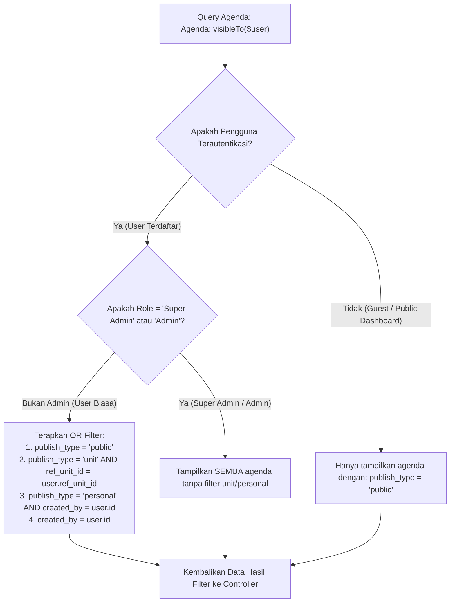

# Role & Matriks Permission (Roles & Permissions)

Dokumen ini menjelaskan struktur peran (*roles*), matriks izin (*permissions*), batasan visibilitas data antar unit (*scoping rule*), dan proteksi antarmuka pengguna pada sistem SIMANJA.

---

## 1. Definisi Peran (Roles Definition)

Sistem mengimplementasikan RBAC (*Role-Based Access Control*) berbasis Spatie Permission dengan 3 (tiga) peran utama operasional:

| Nama Role | Level Akses | Deskripsi & Tanggung Jawab |
| :--- | :--- | :--- |
| **`Super Admin`** | *Full System Control* | Memiliki hak akses mutlak ke seluruh modul, manajemen pengguna, konfigurasi global, manajemen permission matrix, dan dapat melihat seluruh agenda tanpa batasan unit. Hak akses Super Admin **tidak dapat dicabut** oleh sistem. |
| **`Admin`** | *Operational Admin* | Mengelola operasional harian: pembuatan dan pembaruan agenda kantor, pemantauan ruangan, pencatatan notula, dan melihat kalender/riwayat menyeluruh. |
| **`User`** *(Pegawai)* | *Unit / Staff Member* | Pegawai standar di lingkungan Kanreg. Memiliki akses untuk melihat agenda publik, melihat dan mengelola agenda pada unit kerjanya sendiri, serta agenda pribadi yang dibuatnya. |

---

## 2. Matriks Hak Akses (Permission Matrix)

Berikut adalah pemetaan hak akses permission terhadap setiap peran utama:

| Kode Permission | Modul Terkait | Super Admin | Admin | User / Pegawai |
| :--- | :--- | :---: | :---: | :---: |
| `view_dashboard` | Dashboard Utama | ✅ | ✅ | ✅ |
| `view_agenda` | Manajemen Agenda Unit | ✅ | ✅ | ❌ |
| `view_calendar` | Kalender Kegiatan | ✅ | ✅ | ✅ |
| `view_rooms` | Monitoring Ruangan | ✅ | ✅ | ❌ |
| `view_notula` | Notula Rapat | ✅ | ✅ | ❌ |
| `view_history` | Riwayat & Ekspor Agenda | ✅ | ✅ | ✅ |
| `view_users` | Manajemen Akun Pengguna | ✅ | ❌ | ❌ |
| `create_users` | Tambah Akun Pengguna | ✅ | ❌ | ❌ |
| `update_users` | Edit & Reset MFA User | ✅ | ❌ | ❌ |
| `delete_users` | Hapus Akun Pengguna | ✅ | ❌ | ❌ |
| `view_roles` | Role & Permission Matrix | ✅ | ❌ | ❌ |
| `view_master_data`| Master Data & Template Surat | ✅ | ❌ | ❌ |
| `view_settings` | Pengaturan Sistem Global | ✅ | ❌ | ❌ |
| `view_audit` | Audit Trail & Log Keamanan | ✅ | ❌ | ❌ |

---

## 3. Aturan Batasan Visibilitas Data (Data Scoping Rules)

Implementasi pembatasan data agenda antar unit kerja diatur secara terpusat pada model `Agenda` melalui scope Eloquent `visibleTo($query, $user)`:



### Aturan Otorisasi Mutasi (Update & Delete Agenda):
Pada `AgendaController@updateStatus`, `update`, dan `destroy`:
* Pengguna ber-role **Super Admin** atau **Admin** dapat memodifikasi seluruh agenda.
* Pengguna biasa **hanya boleh** mengubah agenda yang ia buat sendiri (`created_by == user.id`).
* Jika agenda berstatus `publish_type = 'personal'`, pengguna lain dilarang memodifikasi (`403 Forbidden`).
* Jika agenda berstatus `publish_type = 'unit'`, pengguna dilarang memodifikasi jika berasal dari unit yang berbeda.

---

## 4. Proteksi Rute & Navigasi Frontend

### A. Komponen Proteksi Rute:
1. **`ProtectedRoute.jsx`**: Memeriksa keberadaan token dan status autentikasi di `AuthContext`. Jika tidak ada token aktif, pengguna langsung diredirect ke `/login`.
2. **`ErrorBoundary.jsx`**: Membungkus modul dinamis seperti `AgendaManagePage` dan `TemplateDetailWorkspace` untuk mencegah *blank screen crash* jika terjadi error render.

### B. Penyaringan Menu Dinamis Sidebar:
Pada `Sidebar.jsx`, setiap menu diverifikasi menggunakan aturan:
```javascript
const allowedItems = group.items.filter(
  item => !item.permission || isSuperAdmin || hasPermission(item.permission)
);
```
Jika pengguna tidak memiliki permission yang dipersyaratkan dan bukan Super Admin, menu tersebut otomatis disembunyikan dari navigasi.

### C. Proteksi Role Permission Matrix UI:
Pada halaman `RolesPermissionsPage.jsx` dan endpoint `RolePermissionController@toggle`:
* Terdapat proteksi keamanan eksplisit: **Permission milik peran `Super Admin` dikunci dan tidak dapat dinonaktifkan** (`403: "Tidak dapat mencabut hak akses dari Super Admin"`).
